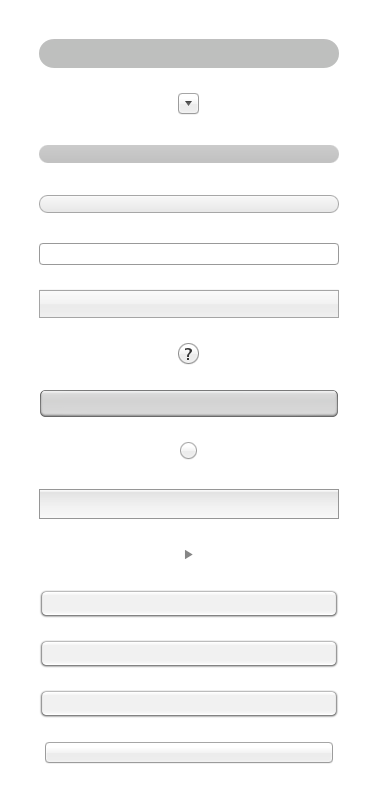

# Bezeru

## Overview

Generate the white transparent overlay and place on it generated buttons with all bezels types.

## Bezels in use

`enum {
   NSRoundedBezelStyle           = 1,
   NSRegularSquareBezelStyle     = 2,
   NSThickSquareBezelStyle       = 3,
   NSThickerSquareBezelStyle     = 4,
   NSDisclosureBezelStyle        = 5,
   NSShadowlessSquareBezelStyle  = 6,
   NSCircularBezelStyle          = 7,
   NSTexturedSquareBezelStyle    = 8,
   NSHelpButtonBezelStyle        = 9,
   NSSmallSquareBezelStyle       = 10,
   NSTexturedRoundedBezelStyle   = 11,
   NSRoundRectBezelStyle         = 12,
   NSRecessedBezelStyle          = 13,
   NSRoundedDisclosureBezelStyle = 14,
   NSInlineBezelStyle = 15,
   NSSmallIconButtonBezelStyle  = 2
}`

## Example

## Contributing

1. Fork it
2. Create your feature branch (`git checkout -b my-new-feature`)
3. Commit your changes (`git commit -am 'Added some feature'`)
4. Push to the branch (`git push origin my-new-feature`)
5. Create new Pull Request